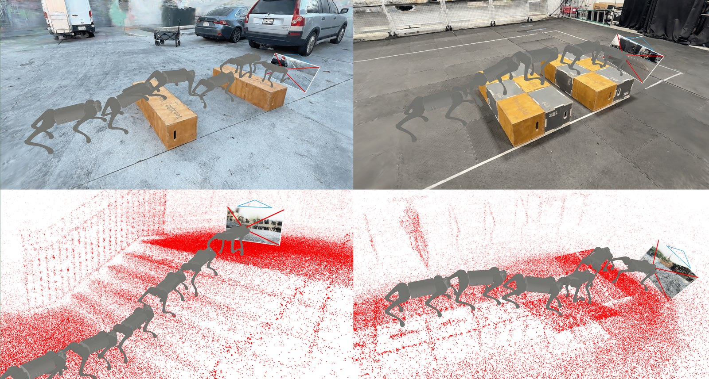
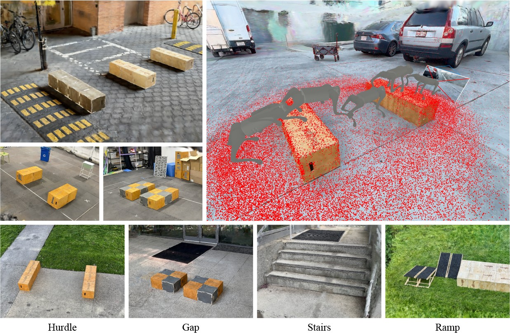

# Neverwhere

**The Neverwhere Visual Parkour Benchmark Suite** · IROS 2026

[Website](https://ziyc.github.io/neverwhere-bench/) · [Paper](https://ziyc.github.io/neverwhere-bench/) · [Data](https://huggingface.co/datasets/ziyc/neverwhere)



Neverwhere is a collection of over sixty hyper-photorealistic, closed-loop evaluation environments for visual
locomotion. Each one is a 3D Gaussian Splatting reconstruction of a real urban indoor or outdoor scene, paired
with an accurate collision mesh and simulated in MuJoCo, so a quadruped policy can be tested against the same
messiness it will meet in the world. Neverwhere is built for evaluation rather than training: a deterministic,
curated set of test cases that can run as automated, continuous testing before real-world deployment. The suite
also ships the toolchain we used to build these scenes from uncalibrated phone captures, so you can add your own.

## Install

Python 3.10, PyTorch 2.2.0 (CUDA 12.1), MuJoCo 3.1.6, dm_control 1.0.18. MuJoCo and dm_control are pinned on
purpose: newer MuJoCo changes contact dynamics enough to flip borderline episodes and shift success rates.

```bash
conda create -n neverwhere python=3.10 -y && conda activate neverwhere
pip install torch==2.2.0 torchvision==0.17.0 --index-url https://download.pytorch.org/whl/cu121
pip install -U pip "setuptools==65.5.0" "wheel==0.38.4"  # gym 0.21 needs the old setuptools
pip install -e .
pip install --no-build-isolation "git+https://github.com/nerfstudio-project/gsplat.git@ec3e715f5733df90d804843c7246e725582df10c"
export MUJOCO_GL=egl  # headless rendering
```

gsplat compiles its CUDA kernels at install time and needs `nvcc`; if the build fails on a too-new gcc, see the
compiler note in [`neverwhere_envs/README.md`](neverwhere_envs/README.md).

## Scenes



The scenes cover four parkour tasks of increasing difficulty: hurdles, gaps, ramps and stairs. Each comes with an
annotated trail of waypoints that defines the evaluation task. `neverwhere/scenes.txt` lists them.

Scenes are hosted on Hugging Face, one self-contained zip each (the 3DGS model, collision geometry, COLMAP and
OpenMVS reconstruction, the original capture and the MuJoCo XMLs; 1 to 4 GB per scene). The four `extra` scenes
are the 1:1 digital twins of the real hurdle and stairs courses used for the sim-to-real parallel evaluation in the
paper (`--extra`).

```bash
python download.py --scenes hurdle_stata_v1 building_31_stairs_v1
python download.py --task stairs
python download.py --all --dest /big/disk/scenes  # elsewhere; the script symlinks it in
```

Scenes land in `neverwhere/tasks/real_scenes/<scene>/`, where the MuJoCo XMLs expect them.

## Evaluating a policy

Every scene is registered for Unitree Go1 and Go2 under several observation modes; ids look like
`Neverwhere-{go1,go2}-{mode}-{scene}-cones` (`{scene}_Nocones` hides the waypoint cones). The action is twelve
target joint positions; the observation is the robot's ego state plus a rendering wrapper of your choice:
`transformer_vision_splat` (stacked 3DGS RGB frames), `splat_rgb_act` (3DGS RGB plus depth), `vision_depth_act`
(MiDaS-style depth from the collision mesh), `heightmap_splat` (privileged scandots). Success rate is the fraction
of waypoints reached.

```python
import neverwhere

env = neverwhere.make("Neverwhere-go1-transformer_vision_splat-hurdle_stata_v1-cones", device="cuda", random=0)
obs = env.reset()
obs, reward, done, info = env.step(env.action_space.sample())
info["splat_rgb"]  # 3DGS ego render, uint8 HxWx3
env.unwrapped.env.task.get_metrics()  # frac_goals_reached, x_displacement
```

As a worked example we include the LucidSim policy (`neverwhere/lucidsim/`) and its checkpoints, `hurdle.pt`
for hurdle scenes and `stairs.pt` for stairs:

```bash
python download.py --checkpoints
python -m neverwhere.evaluate --scene hurdle_stata_v1 --checkpoint checkpoints/lucidsim/hurdle.pt --episodes 10 --video
```

Per-episode metrics, a `summary.json` and third-person plus ego-view videos go to `results/lucidsim/<scene>/`.
The rollout loop in `neverwhere/evaluate.py` is 40 lines; swap in your own policy there.

## Building your own scenes

The toolchain in `neverwhere_envs/` turns uncalibrated multi-view images into a physical digital twin: (1) scan the
scene with a phone, (2) structure-from-motion with COLMAP for camera poses, (3) multi-view stereo with OpenMVS for
the collision mesh, (4) initialize Gaussians from points sampled on that mesh, (5) train the 3DGS model with
depth supervision from the MVS geometry, then (6) re-orient and rescale the scene to metric, z-up coordinates and
(7) label the waypoint trail in a browser-based tool. Steps 1 to 5 are automatic; 6 and 7 take about two minutes.

```bash
pip install -e ".[scene-making]"  # plus COLMAP and OpenMVS on the system, or use neverwhere_envs/docker
python neverwhere_envs/launch.py --scene-name my_scene --dataset-dir /path/to/dataset --gpu-index 0 --gs-type 3dgs
NEVERWHERE_DATASET_ROOT=/path/to/dataset NEVERWHERE_SCENE_NAME=my_scene python neverwhere_envs/tools/label.py
```

The labeling tool writes the Go1 and Go2 scene XMLs. Copy them into `neverwhere/tasks/` and add a line to
`neverwhere/scenes.txt` to register the scene. Full guide, including COLMAP and OpenMVS builds:
[`neverwhere_envs/README.md`](neverwhere_envs/README.md).

## Citation

```bibtex
@inproceedings{chen2026neverwhere,
  title     = {The Neverwhere Visual Parkour Benchmark Suite},
  author    = {Chen, Ziyu and Bao, Henghui and Chang, Haoran and Yu, Alan and Choi, Ran and McClennen, Kai and Huh, Gio
               and Yang, Kevin and Qiu, Ri-Zhao and Ravan, Yajvan and Leonard, John J. and Wang, Xiaolong and Isola, Phillip
               and Yang, Ge and Wang, Yue},
  booktitle = {IEEE/RSJ International Conference on Intelligent Robots and Systems (IROS)},
  year      = {2026},
}
```
